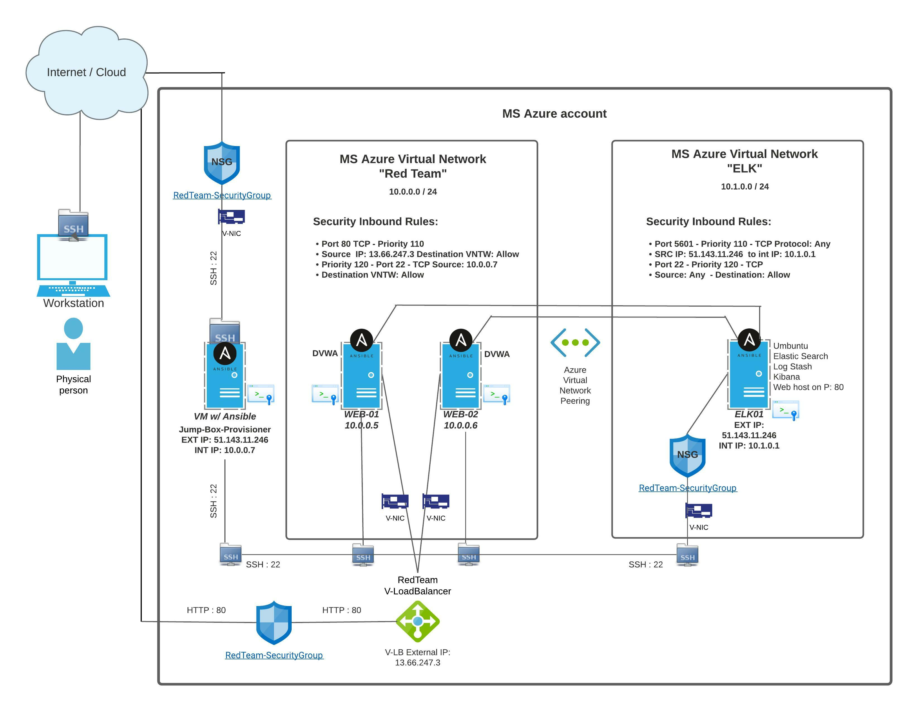

## Automated ELK Stack Deployment
#### Santiago (James) Donohue - Homework
 

### Network Diagram:

| Server Name 	| Publicly Accessible 	| Allowed IP Addresses 	|
|:-----------:	|:-------------------:	|:--------------------:	|
|   Jump Box  	|         Yes         	|     174.50.161.39    	|
|   ELK-SVR   	|         Yes         	|     174.50.161.39   	|
|    Web-1    	|          No         	|    10.0.0.1 to 254   	|
|    Web-2    	|          No         	|    10.0.0.1 to 254   	|
|    Web-3    	|          No         	|    10.0.0.1 to 254   	|

| Server Name 	| Private IP Address 	|
|:-----------:	|:------------------:	|
|    Web-1    	|      10.0.0.5      	|
|    Web-2    	|      10.0.0.6      	|
